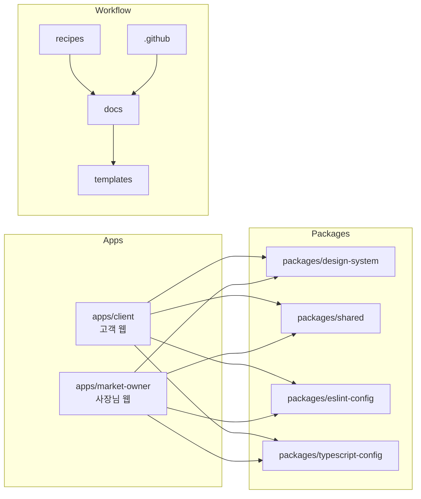
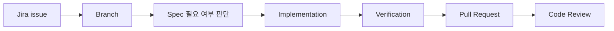

<div align="center">
  <h1>DONGCHIMI CLIENT</h1>
  <p>
    동네 마트의 치명적인 소식을 미리 받아보는 모바일 전단 서비스입니다.
  </p>

  <p>
    <a href="https://www.typescriptlang.org/">
      
    </a>
    <a href="https://nextjs.org/">
      
    </a>
    <a href="https://react.dev/">
      
    </a>
    <a href="https://pnpm.io/ko/">
      
    </a>
    <a href="https://turborepo.com/">
      
    </a>
    <a href="https://vercel.com/">
      
    </a>
  </p>

  <p>
    <a href="#service">Service</a>
    ·
    <a href="#workspace">Workspace</a>
    ·
    <a href="#team">Team</a>
    ·
    <a href="#tech-stack">Tech Stack</a>
    ·
    <a href="#convention">Convention</a>
    ·
    <a href="#documents">Documents</a>
  </p>
</div>

<br />

## Service

**동치미**는 동네 마트의 당일 할인 정보를 모바일 전단 형태로 정리해, 점주는 더 쉽게 알리고 주민은 더 쉽게 확인할 수 있도록 연결하는 서비스입니다.

> 오늘 팔려야 가치가 생기는 정보가 매장 안에서만 머물고 있습니다.
>
> 동치미는 이 정보를 매장 밖으로 꺼내 주민의 손 안까지 연결합니다.

동치미는 동네 마트를 온라인 쇼핑몰로 바꾸려는 서비스가 아닙니다. 당일 할인 정보를 더 잘 정리하고, 더 쉽게 공유하고, 실제 반응까지 확인할 수 있게 만드는 연결 서비스입니다.

## Workspace

| Surface                        | Role                          | Current State                |
| ------------------------------ | ----------------------------- | ---------------------------- |
| `apps/client`                  | 고객 웹, Next.js App Router   | 적용                         |
| `apps/market-owner`            | 사장님 웹, React SPA          | 세팅 PR merge 후 source 추적 |
| `packages/design-system`       | 직접 구현하는 디자인 시스템   | 기본 package 적용            |
| `packages/shared`              | 공통 유틸, 타입, 상수         | placeholder 적용             |
| `packages/eslint-config`       | repo 공통 ESLint config       | 적용                         |
| `packages/typescript-config`   | repo 공통 TypeScript config   | 적용                         |
| `.github/workflows`            | GitHub Actions, PR 자동화     | 기본 CI와 PR 자동화 적용     |
| `docs`, `recipes`, `templates` | 구조, 컨벤션, 작업 절차, spec | 문서 source of truth         |



## Team

팀원 계정과 프로필 이미지는 확인된 GitHub 계정을 기준으로 기재합니다.

<table>
  <tr>
    <th align="center" width="180">장민수</th>
    <th align="center" width="180">박소이</th>
    <th align="center" width="180">이채원</th>
    <th align="center" width="180">한다경</th>
    <th align="center" width="180">이현종</th>
  </tr>
  <tr>
    <td align="center">
      <a href="https://github.com/Tnalxmsk">
        
      </a>
    </td>
    <td align="center">
      <a href="https://github.com/soyyyyy">
        
      </a>
    </td>
    <td align="center">
      <a href="https://github.com/chaewon41">
        
      </a>
    </td>
    <td align="center">
      <a href="https://github.com/hdg0116">
        
      </a>
    </td>
    <td align="center">
      <a href="https://github.com/Navi-Up">
        
      </a>
    </td>
  </tr>
  <tr>
    <td align="center">
      <a href="https://github.com/Tnalxmsk"><strong>@Tnalxmsk</strong></a>
    </td>
    <td align="center">
      <a href="https://github.com/soyyyyy"><strong>@soyyyyy</strong></a>
    </td>
    <td align="center">
      <a href="https://github.com/chaewon41"><strong>@chaewon41</strong></a>
    </td>
    <td align="center">
      <a href="https://github.com/hdg0116"><strong>@hdg0116</strong></a>
    </td>
    <td align="center">
      <a href="https://github.com/Navi-Up"><strong>@Navi-Up</strong></a>
    </td>
  </tr>
</table>

## Tech Stack

Status는 현재 `develop`의 추적 파일과 팀 기술 결정 방향을 함께 반영합니다.

### Core

| Label                                                                                                                                                                                                                                               | Category     | Selection                                                         | Status | Why                                                                   |
| --------------------------------------------------------------------------------------------------------------------------------------------------------------------------------------------------------------------------------------------------- | ------------ | ----------------------------------------------------------------- | ------ | --------------------------------------------------------------------- |
|                                                                                                                  | Language     | [TypeScript](https://www.typescriptlang.org/)                     | 적용   | 앱, package, config 전반에서 타입 안정성을 기본값으로 둡니다.         |
|   | Monorepo     | [pnpm](https://pnpm.io/ko/) + [Turborepo](https://turborepo.com/) | 적용   | workspace dependency, task cache, generator를 repo 단위로 관리합니다. |
|                                                                                                                          | 고객 UI      | [Next.js](https://nextjs.org/) App Router                         | 적용   | 고객 웹은 라우팅, 빌드, 배포 최적화가 필요한 제품 앱입니다.           |
|                                                                                                                                  | 사장님 UI    | [React](https://react.dev/) SPA                                   | 결정   | 별도 제품 컨벤션이 없는 사장님 웹을 가볍고 명확하게 시작합니다.       |
|                                                                                                               | 사장님 Route | [React Router](https://reactrouter.com/)                          | 결정   | React SPA 안에서 명시적인 route config와 nested route를 관리합니다.   |

### Product Foundation

| Label                                                                                                                                                          | Category      | Selection                                           | Status    | Why                                                                      |
| -------------------------------------------------------------------------------------------------------------------------------------------------------------- | ------------- | --------------------------------------------------- | --------- | ------------------------------------------------------------------------ |
|                                                                             | Network       | [ky](https://github.com/sindresorhus/ky#readme)     | 적용      | 작은 API wrapper로 timeout, error normalization, JSON 응답을 통일합니다. |
|                       | Server State  | [TanStack Query](https://tanstack.com/query/latest) | 적용      | 서버 캐시, loading/error 상태, refetch 정책을 앱 표준으로 둡니다.        |
|                                                                 | Client State  | [Zustand](https://zustand-demo.pmnd.rs/)            | 결정      | 전역 UI/client state가 필요할 때 작은 store 단위로 분리합니다.           |
|               | Form          | [React Hook Form](https://react-hook-form.com/)     | 결정      | form state와 validation 결합 비용을 줄입니다.                            |
|                                           | Validation    | [Zod](https://zod.dev/)                             | 결정      | TypeScript와 함께 runtime schema와 form validation을 공유합니다.         |
|                                              | Styling       | [vanilla-extract](https://vanilla-extract.style/)   | 결정      | 디자인 시스템 적용을 위해 type-safe CSS와 정적 추출을 우선합니다.        |
|                                                    | Design System | 직접 구현                                           | 기본 적용 | `packages/design-system`에서 공통 컴포넌트와 스타일 계약을 관리합니다.   |
|  | API Schema    | [openapi-typescript](https://openapi-ts.dev/)       | 후속      | API contract가 안정되면 타입 생성으로 client drift를 줄입니다.           |

### Quality, Delivery, Analytics

| Label                                                                                                                                                                                                                                                                                                                                                                                                                  | Category                | Selection                                                                                                                                                                     | Status    | Why                                                                     |
| ---------------------------------------------------------------------------------------------------------------------------------------------------------------------------------------------------------------------------------------------------------------------------------------------------------------------------------------------------------------------------------------------------------------------- | ----------------------- | ----------------------------------------------------------------------------------------------------------------------------------------------------------------------------- | --------- | ----------------------------------------------------------------------- |
|                                                                             | Code Quality            | [ESLint](https://eslint.org/), [Prettier](https://prettier.io/), [Husky](https://typicode.github.io/husky/), [lint-staged](https://github.com/lint-staged/lint-staged#readme) | 적용      | 로컬과 CI에서 format, lint, typecheck를 같은 기준으로 실행합니다.       |
|                                                         | Unit / Integration Test | [Vitest](https://vitest.dev/), [React Testing Library](https://testing-library.com/docs/react-testing-library/intro/), [MSW](https://mswjs.io/)                               | 후속      | 컴포넌트 동작, hook, API mock 검증을 위한 기본 조합입니다.              |
|                                                                                                                                                                                                                                                                                     | E2E Test                | [Playwright](https://playwright.dev/)                                                                                                                                         | 후속      | 앱 bootstrap smoke부터 브라우저 기반 회귀 검증까지 확장합니다.          |
|                                                                                                                                                    | Component Docs          | [Storybook](https://storybook.js.org/) + [Chromatic](https://www.chromatic.com/)                                                                                              | 후속      | 디자인 시스템과 shared component의 상태별 문서화를 담당합니다.          |
|                                                                                                                                                                                                                                                                                                  | Deploy                  | [Vercel](https://vercel.com/)                                                                                                                                                 | 결정      | Next.js 최적화, preview deployment, GitHub 연동 자동 배포를 활용합니다. |
|                                                                                                                                                     | CI/CD                   | [GitHub Actions](https://github.com/features/actions) + Vercel CD                                                                                                             | 적용/결정 | PR에서는 검증을, main merge 이후에는 배포 자동화를 담당합니다.          |
|    | Monitoring / Analytics  | Sentry + Discord, Google Analytics 또는 Vercel Analytics, Amplitude                                                                                                           | 후속      | 오류 감지, 알림, 사용자 행동 분석은 제품 지표가 생긴 뒤 연결합니다.     |

## Local Development

### Runtime

| Tool | Version Source                   |
| ---- | -------------------------------- |
| Node | [`.node-version`](.node-version) |
| pnpm | [`package.json`](package.json)   |

### Setup

```bash
pnpm install
```

### App Ports

| App       | Command        | Port | Note                            |
| --------- | -------------- | ---- | ------------------------------- |
| 고객 웹   | `pnpm dev:web` | 3000 | Next.js dev server              |
| 사장님 웹 | 추후 추가      | 5173 | React app 세팅 PR merge 후 고정 |

### Verification

```bash
git diff --check
pnpm format:check
pnpm lint
pnpm typecheck
pnpm build
```

문서만 변경한 경우 최소 검증은 아래 두 명령입니다.

```bash
git diff --check
pnpm format:check
```

## Convention

세부 규칙은 문서가 source of truth입니다. README에는 리뷰 전에 빠르게 확인해야 하는 핵심만 둡니다.

### Code

| Target         | Convention   | Example                                        |
| -------------- | ------------ | ---------------------------------------------- |
| Folder         | `kebab-case` | `user-profile/`                                |
| Component file | `PascalCase` | `UserCard.tsx`                                 |
| Hook/API/Utils | `kebab-case` | `use-auth.ts`, `auth-api.ts`, `format-date.ts` |
| TanStack Query | `kebab-case` | `use-user-query.ts`, `use-user-mutation.ts`    |

- 컴포넌트는 arrow function으로 선언하고 일반 컴포넌트는 named export를 사용합니다.
- 의미 없는 wrapper `div`는 피하고 Fragment 또는 semantic tag를 우선합니다.
- `var`는 사용하지 않고, 재할당이 필요 없으면 `const`를 사용합니다.
- Boolean 값은 `is` prefix를 권장합니다.
- 타입 이름은 `PascalCase`, props 타입은 `Props` suffix를 사용합니다.
- 버튼, label, heading level, focus-visible, keyboard interaction을 접근성 기본값으로 봅니다.

자세한 기준: [Coding Convention](docs/conventions/coding.md)

### Git / Jira / PR

| Topic  | Rule                                                                                                                     |
| ------ | ------------------------------------------------------------------------------------------------------------------------ |
| Branch | `prefix/{scope}/{JIRAKEY}-work-summary`                                                                                  |
| Commit | `prefix(scope): {JIRAKEY} work summary`                                                                                  |
| PR     | `[PREFIX](scope): {JIRAKEY} work summary`                                                                                |
| Jira   | root/docs/CI/workflow는 `DCMFE-*`, client는 `DCMCL-*`, design-system package는 `DCMDS-*`, design-system web은 `DCMDSW-*` |

예시:

```text
docs/root/DCMFE-24-readme-project-guide
docs(docs): DCMFE-24 README 프로젝트 소개 정리
[DOCS](docs): DCMFE-24 README 프로젝트 소개 정리
```



- 구현 전 Jira 이슈를 만들고, 구현 착수 시 `진행 중` 상태로 전환합니다.
- 변경 surface가 다르면 커밋을 분리합니다. 한 PR에서 리뷰하기 어려우면 Jira도 나눕니다.
- PR 본문은 [Pull Request Template](.github/pull_request_template.md)과 [Pull Request Writing](docs/workflows/pull-request-writing.md)을 기준으로 작성합니다.
- 실제 실행한 검증만 PR과 최종 요약에 적고, 생략한 검증은 이유를 남깁니다.

자세한 기준: [Git Convention](docs/conventions/git.md), [Jira Issue Authoring](docs/workflows/jira-issue-authoring.md), [PR Checklist](docs/workflows/pr-checklist.md)

### Ground Rules

| Rule          | Standard                                                                                        |
| ------------- | ----------------------------------------------------------------------------------------------- |
| Work source   | Jira는 작업 단위와 상태의 기준입니다.                                                           |
| Decision log  | 회의나 메신저 결정도 구현에 영향을 주면 Jira 또는 docs에 남깁니다.                              |
| Spec gate     | 새 page, form, API, shared component, 디자인시스템 컴포넌트는 spec 필요 여부를 먼저 판단합니다. |
| Communication | 작업 공유는 `오늘 진행`, `막힌 점`, `다음 action` 중심으로 짧게 남깁니다.                       |
| Schedule      | 일정은 Jira board와 milestone 기준으로 관리하고, 리스크는 발견 시점에 공유합니다.               |
| Convention    | 컨벤션 변경은 README보다 가까운 source of truth 문서에 먼저 반영합니다.                         |

## Documents

| Area            | Link                                                     |
| --------------- | -------------------------------------------------------- |
| 문서 인덱스     | [docs/index.md](docs/index.md)                           |
| 저장소 구조     | [Repo Structure](docs/architecture/repo-structure.md)    |
| 앱 구조         | [App Structure](docs/architecture/app-structure.md)      |
| 디자인 시스템   | [Design System](docs/architecture/design-system.md)      |
| 로컬 개발       | [Local Development](docs/workflows/local-development.md) |
| CI              | [CI](docs/workflows/ci.md)                               |
| Spec 작성       | [Spec Writing](docs/workflows/spec-writing.md)           |
| Turbo Generator | [Turbo Generators](docs/workflows/turbo-generators.md)   |
| Agent Guide     | [AGENTS.md](AGENTS.md)                                   |
| Jira 템플릿     | [Jira Issue Template](templates/jira-issue-template.md)  |
| Decision Log    | [Decision Log Guide](docs/decisions/index.md)            |
